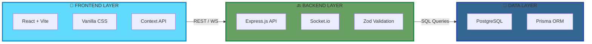

<div align="center">

# 🚚 TransitOps - Smart Transport Operations Platform

### *End-to-end transport operations platform that digitizes vehicle, driver, dispatch, maintenance, and expense management*

[](LICENSE)
[](https://nodejs.org/)
[](https://reactjs.org/)
[](https://www.postgresql.org/)
[](https://www.prisma.io/)

---

**TransitOps is a centralized platform that replaces spreadsheets and manual logbooks, allowing organizations to manage the complete lifecycle of their transport operations—from vehicle registration and driver management to dispatching, maintenance, fuel logging, and analytics.**

</div>

## 🎯 Key Features

<div align="center">

| 📊 **Dashboard & Analytics** | 🚚 **Vehicle & Driver Mgt** | 🗺️ **Trip Dispatch** | 🔧 **Maintenance & Fuel** |
|:---------------------------|:---------------------------|:------------------------|:--------------------------|
| Active Trips & Fleet KPIs | Real-time vehicle status | Automated status transitions | Service logs & scheduling |
| Fuel Efficiency metrics | License & safety tracking | Cargo weight validation | Operational cost tracking |
| Vehicle ROI calculations | RBAC for operations | Complete trip lifecycle | Expense management |

</div>

### Complete Feature Set

#### 📊 Dashboard & Analytics
- 🎯 **Real-time KPI Dashboard** - Live overview of Active Vehicles, Pending Trips, and Fleet Utilization (%).
- 📈 **Performance Analytics** - Fuel Efficiency (Distance/Fuel) and Vehicle ROI calculations.
- 📉 **Cost Tracking** - Automatically compute total operational cost (Fuel + Maintenance) per vehicle.
- 📑 **Export Capabilities** - Support for CSV and optional PDF report exports.
- 🎨 **Visual Filters** - Advanced filtering by vehicle type, status, and region.

#### 🚚 Vehicle & Driver Management
- 📦 **Master Vehicle Registry** - Centralized tracking of capacity, odometer, acquisition cost, and live status.
- 👤 **Comprehensive Driver Profiles** - Track license validity, safety scores, contact info, and availability.
- 🛡️ **Strict Business Rules** - Automatic validation preventing suspended drivers or "In Shop" vehicles from dispatch.
- 🔄 **Real-Time Status Synchronization** - Dispatching automatically updates vehicle and driver statuses to "On Trip".

#### 📋 Trip Management & Dispatch
- ⚡ **Streamlined Dispatch Workflow** - Create trips mapping source to destination with load validation.
- 🔄 **Trip Lifecycle Management** - Track statuses from Draft → Dispatched → Completed → Cancelled.
- ⚖️ **Safety Validations** - Ensure cargo weight never exceeds a vehicle's maximum load capacity.

#### 🔧 Maintenance & Expenses
- 📅 **Automated Maintenance Logs** - Creating records instantly changes vehicle status to "In Shop", hiding it from dispatch.
- 💰 **Expense Tracking** - Record fuel logs (liters, cost, date) and ancillary expenses like tolls.
- ✅ **Lifecycle Recovery** - Closing maintenance instantly restores vehicles back to the Available fleet.

#### 🔐 Security & Authentication
- 🔑 **Secure Authentication** - Email and password login for all operational staff.
- 🛡️ **Role-Based Access Control (RBAC)** - Tailored access for Fleet Managers, Drivers, Safety Officers, and Financial Analysts.

---

## 🏗️ Architecture Overview

<div align="center">



**Architecture Flow:**
- **Frontend Layer**: React SPA built with Vite, utilizing pure CSS/CSS Modules for a custom aesthetic and React Context for lightweight state management.
- **Backend Layer**: Scalable Node.js + Express REST API featuring real-time Socket.io updates and robust Zod input validation.
- **Data Layer**: Relational PostgreSQL database managed by Prisma ORM for type-safety and flawless database schema design.

</div>

---

## 📁 Project Structure

```
TransitOps/
│
├── 📄 README.md                        # You are here!
├── 📄 docs/ARCHITECTURE.md             # Architecture documentation
│
├── 🔙 backend/                         # Node.js + Express API
│   ├── 📦 package.json                 # Backend dependencies
│   │
│   ├── 🗄️ prisma/                      # Database layer
│   │   └── 📋 schema.prisma            # Strict database schema definition
│   │
│   └── 💻 src/                         # Source code
│       ├── 🚀 server.js                # Application entry point
│       ├── 🎮 controllers/             # Request handlers & Business Logic
│       ├── 🛡️ middlewares/             # RBAC & Validation middleware
│       ├── 🛣️ routes/                  # API endpoint definitions
│       └── 🏢 services/                # Complex DB query abstraction
│
└── 🎨 frontend/                        # React + Vite Frontend
    ├── 📦 package.json                 # Frontend dependencies
    └── 💻 src/                         # Source code
        ├── 🧩 components/              # Reusable UI components
        ├── 📄 pages/                   # Application views (Dashboard, Vehicles)
        ├── 🌐 context/                 # Global state (Auth, Roles)
        ├── 📡 services/                # API communication layers
        └── 🛠️ utils/                   # Helper functions (Formatting, Math)
```
