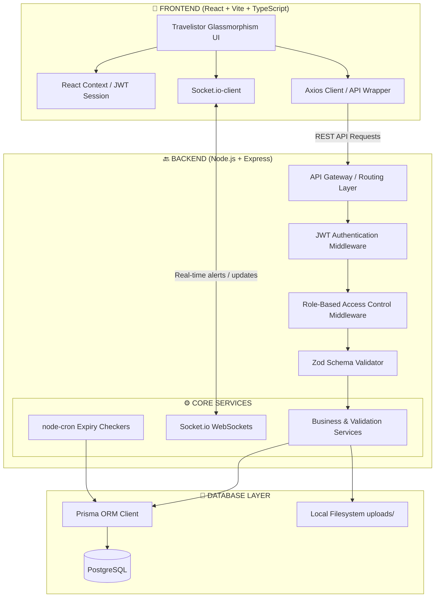

<div align="center">

# 🚚 TransitOps - Smart Transport Operations Platform

### *A premium, end-to-end fleet operations platform featuring role-based controls, real-time analytics, compliance enforcement, and automated logistics scheduling.*

[](LICENSE)
[](https://nodejs.org/)
[](https://reactjs.org/)
[](https://www.postgresql.org/)
[](https://www.prisma.io/)

---

**TransitOps is a state-of-the-art enterprise transport operations platform designed to digitize, validate, and optimize logistics workflows. Built with a premium Travelistor Glassmorphism theme, it replaces antiquated spreadsheet logging with automated validation, real-time status synchronization, and precise ROI cost-accounting.**

</div>

---

## 🎯 Key Feature Modules

TransitOps contains **15 fully-implemented feature modules** divided into core, administrative, and compliance layers:

### 📊 1. Dashboard & Analytics
- **Live KPI Counters:** Tracks fleet utilization rate, active trips, pending dispatches, monthly operational costs, and overall fleet health.
- **Auto-Refresh Data:** Polls and updates database-wide statistics every 30 seconds to maintain operational accuracy.
- **Operational Charts (Recharts):** High-fidelity visualizations including:
  - Vehicle utilization breakdown (Pie/Doughnut)
  - Trips per month statistics (Bar)
  - Fuel consumption trends (Line)
  - Maintenance costs distribution (Bar)
  - Ancillary & fuel expense breakdowns (Pie)
  - Driver safety metrics (Bar)

### 🚚 2. Fleet & Driver Management
- **Master Vehicle Registry:** Centralized tracking of registration numbers, odometer readings, vehicle class (Truck, Van, Bus, Motorcycle), max capacity limits, acquisition costs, and document attachments.
- **Detailed Driver Profiles:** Validates driver licenses, category capabilities, safety scores, and real-time availability.
- **Validation Constraints:** Automatically checks license and insurance expirations, blocking dispatch if credentials have lapsed or if drivers/vehicles are suspended or undergoing maintenance.

### 📋 3. Dispatch & Trip Lifecycle
- **Step-by-Step Stepper UI:** Seamlessly tracks trips through four distinct phases: `Draft` ➔ `Dispatched` ➔ `Completed` ➔ `Cancelled`.
- **Cargo Weight Safety Check:** Enforces server-side constraints preventing cargo loads from exceeding a vehicle's maximum load capacity.
- **Atomic State Synchronization:** Dispatching a trip locks both the driver and vehicle into `ON_TRIP` status; completing or cancelling a trip restores them to `AVAILABLE` atomically via database transactions.

### 🔧 4. Maintenance & Expenses
- **Smart Service Log:** Submitting maintenance reports atomically updates vehicles to `IN_SHOP` status, excluding them from new dispatches. Closing log restores them.
- **Operational Cost Accounting:** Integrates fuel logs (liters, total cost) and ancillary expenses (tolls, parking, repairs) to calculate individual vehicle ROIs.

### 🔔 5. Advanced App Components
- **Real-Time Notification System:** Socket-connected notification center informing officers of upcoming license/insurance expirations and pending maintenance logs.
- **Unified Global Search:** Navbar-integrated debounced search querying vehicles, drivers, and trips concurrently. Cache history is saved via `localStorage`.
- **Sorting, Filtering, & Pagination:** Standardized `TableSort` and `AdvancedFilter` components with ellipsis pagination, custom page sizing, and multi-column sort headers.
- **PDF & CSV Reports Engine:** Filter and download downloadable CSV files or auto-formatted PDF reports of trip details, expenses, and fuel usage.
- **Compliance Audit Logging:** Real-time database event logger detailing the actor, target resource, action type (CREATE/UPDATE/DELETE/LOGIN), and IP address of all modifications.
- **Settings Module:** Custom profiling, application unit preferences, and a live Role-Based Access Control (RBAC) permission grid.

---

## 🏗️ Architecture Overview

TransitOps uses a modern, multi-tier service architecture optimized for fast load times and clean component separation:



---

## 🚀 Quick Start (Local Setup)

### Prerequisites
- [Node.js](https://nodejs.org/) (Version 18 or 20+)
- [PostgreSQL](https://www.postgresql.org/) database running locally

### 1. Database Setup
Create a PostgreSQL database named `transitops`.
Initialize your configuration in `backend/.env` (use `backend/.env.example` as a template):
```env
PORT=5001
JWT_SECRET=super_secret_jwt_key_change_me_in_production
DATABASE_URL="postgresql://<username>:<password>@localhost:5432/transitops?schema=public"
CORS_ORIGIN=http://localhost:5173
JWT_EXPIRES_IN=8h
NODE_ENV=development
```

### 2. Run Backend Setup
Execute migrations and seed the initial dataset:
```bash
cd backend
npm install
npx prisma db push --force-reset
node prisma/seed.js
npm run dev     # Launches dev server on http://localhost:5001
```

### 3. Run Frontend Setup
Launch the client application:
```bash
cd ../frontend
npm install
npm run dev     # Launches UI on http://localhost:5173
```

---

## 🔐 Login Credentials (All passwords: `Password123`)

Access permissions are enforced throughout both the frontend routing and backend endpoints:

| Email | Role | Accessible Sections & Controls |
|-------|------|--------------------------------|
| `manager@transitops.com` | Fleet Manager | Full administrative access, Settings management, Users, Audit Logs, and Fleet. |
| `dispatcher@transitops.com` | Dispatcher | Trips management, Fleet statuses, Dispatch scheduling, and Route planning. |
| `safety@transitops.com` | Safety Officer | Drivers management, Driver safety scoring, license expirations, and status suspension/restoration. |
| `analyst@transitops.com` | Financial Analyst | Expenses tracking, Fuel logging, Analytics dashboard, and CSV/PDF export. |

---

## 🛡️ Business Rules Enforced (Server-Side)

| Rule Description | Enforcing Component | Handling Behavior |
|------------------|----------------------|-------------------|
| **Unique Vehicle Reg.** | PostgreSQL / Prisma | Rejects duplicate registration numbers with `400 Bad Request`. |
| **Active Vehicle Check** | `GET /vehicles/available` | Excludes vehicles in `IN_SHOP` or `RETIRED` statuses from dispatch dropdowns. |
| **Active Driver Check** | `GET /drivers/available` | Excludes drivers marked as `SUSPENDED` or `OFF_DUTY` from active routes. |
| **Licensing Expiration Check** | `dispatchTrip()` | Rejects dispatch if the driver's license expiration date is in the past. |
| **Insurance Expiration Check** | `dispatchTrip()` | Rejects dispatch if the vehicle's insurance policy has expired. |
| **Cargo Overload Check** | `dispatchTrip()` | Checks `cargo_weight > max_load_capacity`. Throws `400 Overload Warning`. |
| **Atomic Dispatch** | Prisma `$transaction()` | Atomically transitions Driver & Vehicle to `ON_TRIP`. Reverts on failures. |
| **Atomic Completion** | Prisma `$transaction()` | Records odometer/fuel updates, returning driver/vehicle back to `AVAILABLE`. |
| **Rate-Limited Lockout** | `authService.login()` | Multi-attempt tracking. Lockout duration is 15 minutes after 5 consecutive failures. |
| **Self-Deletion Protection** | `/api/users/:id` | Rejects requests matching the logged-in user ID, preventing admin lockouts. |

---

## 📁 Project Directory Structure

```
TransitOps/
│
├── 📂 backend/                         # Express REST API & Database Management
│   ├── 📦 package.json                 # Backend dependencies & custom scripts
│   ├── 🔐 .env                         # Local environment configuration
│   │
│   ├── 🗄️ prisma/                      # Database Schema & Seed Data
│   │   ├── 📋 schema.prisma            # Core DB model relations & indexes
│   │   └── 🌱 seed.js                  # Pre-seeded users, vehicles, and logs
│   │
│   └── 💻 src/                         # Backend Source Code
│       ├── 🚀 server.js                # App gateway & Socket.io setup
│       ├── 🎮 controllers/             # Express request coordinators
│       ├── ⏰ jobs/                    # node-cron scheduled tasks (License Expirations)
│       ├── 🛡️ middlewares/             # JWT, Zod validations, and RBAC rules
│       ├── 🛣️ routes/                  # Express route controllers
│       ├── 🏢 services/                # Business logic implementation
│       └── 🏢 utils/                   # Shared helpers (Prisma clients, pagination)
│
├── 🎨 frontend/                        # React Client Application
│   ├── 📦 package.json                 # Client dependencies & Vite scripts
│   ├── 🎨 tailwind.config.js           # Tailwind configurations (if required)
│   │
│   └── 💻 src/                         # Client Source Code
│       ├── 🚀 main.tsx                 # Client setup & stylesheets mount
│       ├── 🧩 components/              # Global components & layouts
│       │   ├── 📁 Layout/              # Custom Sidebar & App Layout
│       │   ├── 📁 ui/                  # Reusable Badge, Modal, and Spinner elements
│       │   ├── 🔍 GlobalSearch.tsx     # Debounced global search component
│       │   └── 🔔 NotificationDropdown.tsx # Real-time notification menu
│       │
│       ├── 🌐 context/                 # State providers (JWT Auth validation)
│       ├── 📄 pages/                   # Redesigned view controllers (Trips, Settings, Users...)
│       └── 📡 services/                # Axios API request abstractions
│
└── 📂 docs/                            # Unified Technical Guides
    ├── 📄 ARCHITECTURE.md              # Technical stack & design paradigms
    ├── 📄 api-reference.md             # Standard API schema endpoints
    ├── 📄 decisions.md                 # Design decisions & rules checklist
    └── 📄 er-diagram.md                # DB Entity Relationship visualizations
```
