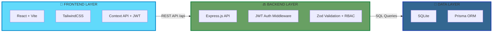

<div align="center">

# 🚚 TransitOps - Smart Transport Operations Platform

### *End-to-end transport operations platform that digitizes vehicle, driver, dispatch, maintenance, and expense management*

[](LICENSE)
[](https://nodejs.org/)
[](https://reactjs.org/)
[](https://sqlite.org/)
[](https://www.prisma.io/)

---

**TransitOps is a centralized platform that replaces spreadsheets and manual logbooks, allowing organizations to manage the complete lifecycle of their transport operations—from vehicle registration and driver management to dispatching, maintenance, fuel logging, and analytics.**

</div>

## 🚀 Quick Start (Hackathon Setup)

### Prerequisites
- Node.js 18+ installed
- No database install needed — uses **SQLite** (file-based, zero config)

### 1. Backend Setup

```bash
cd backend
npm install
npx prisma migrate dev --name init
node prisma/seed.js
npm run dev   # Starts on http://localhost:5000
```

### 2. Frontend Setup

```bash
cd frontend
npm install
npm run dev   # Starts on http://localhost:5173
```

### 3. Login Credentials (All passwords: `Password123`)

| Email | Role | Access |
|-------|------|--------|
| `manager@transitops.com` | Fleet Manager | Vehicles, Maintenance, Settings |
| `dispatcher@transitops.com` | Dispatcher | Trips, Fleet view |
| `safety@transitops.com` | Safety Officer | Drivers, suspend/restore |
| `analyst@transitops.com` | Financial Analyst | Expenses, Analytics, CSV export |

---

## 🎯 Key Features

<div align="center">

| 📊 **Dashboard & Analytics** | 🚚 **Vehicle & Driver Mgt** | 🗺️ **Trip Dispatch** | 🔧 **Maintenance & Fuel** |
|:---------------------------|:---------------------------|:------------------------|:--------------------------|
| Active Trips & Fleet KPIs | Real-time vehicle status | Automated status transitions | Service logs & scheduling |
| Fuel Efficiency metrics | License & safety tracking | Cargo weight validation | Operational cost tracking |
| Vehicle ROI calculations | RBAC for operations | Complete trip lifecycle | Expense management |

</div>

### Complete Feature Set

#### 📊 Dashboard & Analytics
- 🎯 **Real-time KPI Dashboard** - Live overview of Active Vehicles, Pending Trips, and Fleet Utilization (%).
- 📈 **Performance Analytics** - Fuel Efficiency (Distance/Fuel) and Vehicle ROI calculations.
- 📉 **Cost Tracking** - Automatically compute total operational cost (Fuel + Maintenance) per vehicle.
- 📑 **Export Capabilities** - CSV report export with real trip data.
- 🔄 **Auto-refresh** - Dashboard updates every 30 seconds automatically.

#### 🚚 Vehicle & Driver Management
- 📦 **Master Vehicle Registry** - Centralized tracking of capacity, odometer, acquisition cost, and live status.
- 👤 **Comprehensive Driver Profiles** - Track license validity, safety scores, contact info, and availability.
- 🛡️ **Strict Business Rules** - Automatic validation preventing suspended drivers or "In Shop" vehicles from dispatch.
- 🔄 **Real-Time Status Synchronization** - Dispatching automatically updates vehicle and driver statuses to "On Trip".

#### 📋 Trip Management & Dispatch
- ⚡ **Streamlined Dispatch Workflow** - Create trips mapping source to destination with load validation.
- 🔄 **Trip Lifecycle Management** - Track statuses from Draft → Dispatched → Completed → Cancelled.
- ⚖️ **Safety Validations** - Ensure cargo weight never exceeds a vehicle's maximum load capacity (enforced server-side).
- ✅ **Complete/Cancel Trips** - Automatically restores vehicle and driver status to Available.

#### 🔧 Maintenance & Expenses
- 📅 **Automated Maintenance Logs** - Creating records instantly changes vehicle status to "In Shop", hiding it from dispatch.
- 💰 **Expense Tracking** - Record fuel logs (liters, cost, date) and ancillary expenses like tolls.
- ✅ **Lifecycle Recovery** - Closing maintenance instantly restores vehicles back to the Available fleet.

#### 🔐 Security & Authentication
- 🔑 **Secure JWT Authentication** - Real login with bcrypt password hashing and 5-attempt lockout.
- 🛡️ **Role-Based Access Control (RBAC)** - Tailored access for Fleet Managers, Dispatchers, Safety Officers, and Financial Analysts.
- 🔒 **Session Persistence** - JWT token stored in localStorage, session restored on page refresh.

---

## 🏗️ Architecture Overview

<div align="center">



**Architecture Flow:**
- **Frontend Layer**: React SPA built with Vite, utilizing TailwindCSS and React Context for JWT-based auth state.
- **Backend Layer**: Scalable Node.js + Express REST API featuring JWT authentication, RBAC middleware, and Zod input validation.
- **Data Layer**: SQLite database managed by Prisma ORM for type-safe, zero-config local database access.

</div>

---

## 📁 Project Structure

```
TransitOps/
│
├── 📄 README.md                        # You are here!
│
├── 🔙 backend/                         # Node.js + Express API
│   ├── 📦 package.json                 # Backend dependencies
│   ├── 🔐 .env                         # Environment variables (not committed)
│   │
│   ├── 🗄️ prisma/                      # Database layer
│   │   ├── 📋 schema.prisma            # SQLite database schema
│   │   └── 🌱 seed.js                  # Seed script (4 users, 5 vehicles, 4 drivers)
│   │
│   └── 💻 src/                         # Source code
│       ├── 🚀 server.js                # Application entry point
│       ├── 🎮 controllers/             # Request handlers
│       ├── 🛡️ middlewares/             # JWT auth, RBAC, validation
│       ├── 🛣️ routes/                  # API endpoint definitions
│       └── 🏢 services/                # Business logic & DB queries
│
└── 🎨 frontend/                        # React + Vite Frontend
    ├── 📦 package.json                 # Frontend dependencies
    └── 💻 src/                         # Source code
        ├── 🧩 components/              # Layout, ProtectedRoute
        ├── 📄 pages/                   # Dashboard, Fleet, Drivers, Trips, etc.
        ├── 🌐 context/                 # AuthContext (JWT + session restore)
        └── 📡 services/                # api.ts (fetch wrapper with JWT headers)
```

---

## 🛡️ Business Rules Enforced (Server-Side)

| Rule | Where Enforced |
|------|---------------|
| Registration numbers must be unique | DB unique constraint |
| Retired/In Shop vehicles hidden from dispatch | `GET /vehicles/available` filter |
| Suspended drivers blocked from dispatch | `GET /drivers/available` filter |
| Expired license → blocked from dispatch | `dispatchTrip()` service validation |
| Cargo weight > vehicle capacity → blocked | `dispatchTrip()` service validation |
| Dispatch atomically sets Vehicle + Driver → ON_TRIP | Prisma `$transaction()` |
| Complete trip atomically restores Vehicle + Driver → AVAILABLE | Prisma `$transaction()` |
| Maintenance log → Vehicle → IN_SHOP (atomic) | Prisma `$transaction()` |
| 5 failed login attempts → 15-minute lockout | `authService.login()` |
