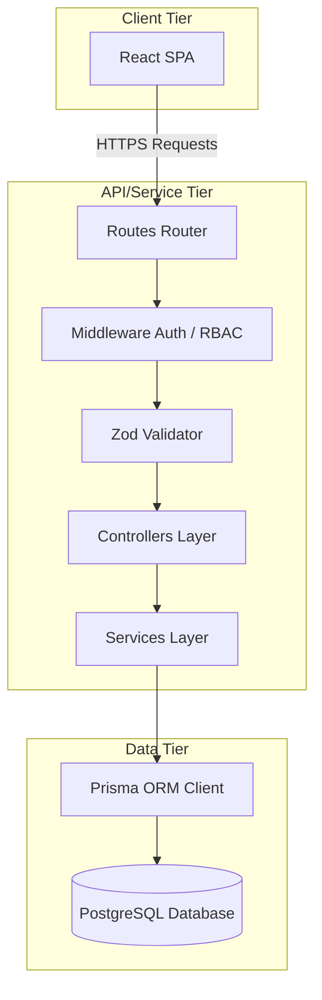

# TransitOps System Architecture

This document details the architectural decisions, design patterns, and security frameworks implemented in the TransitOps Platform.

---

## 🏗️ Architectural Topology & Layering

TransitOps follows a clean, decoupled **Layered (3-Tier) Architecture** to separate concerns, ensure high maintainability, and guarantee that business logic is completely isolated from HTTP delivery semantics.



### 1. Presentation/Client Layer (`frontend/`)
- Single-page application built on **React** and bundled using **Vite**.
- Uses **Tailwind v4** for CSS-in-JS utility-based component design.
- Communication with the backend is managed by an **Axios service instance** that interceptively injects the JWT token on every outbound request and triggers redirect-to-login on any `401 Unauthorized` response.
- Access restrictions are dual-enforced: UI navigation tabs are hidden based on user roles, and backend RBAC returns HTTP 403 on illegal route hits.

### 2. Controller Layer (`backend/src/controllers/`)
- Purely handles HTTP request parsing, status responses, and routing.
- Validates query strings and payloads, extracts authenticated user data, and passes clean parameters into the Service layer.
- Retains zero business logic and delegates operations directly to the services.

### 3. Service Layer (`backend/src/services/`)
- The core processing engine of the TransitOps platform.
- **Every business rule is enforced here.**
- Interfaces with the database through the Prisma client.
- Coordinates cross-model validations and executes multi-row modifications within safe transactions.

### 4. Data Layer (`backend/prisma/`)
- Schema modeled on PostgreSQL using Prisma DSL.
- Includes physical constraints, relational maps, and indexes to support fast query performance.

---

## 🔒 Security & Access Control

### 1. Stateless Authentication (JWT)
- Authenticates requests using JSON Web Tokens (JWT) signed with a secure server-side key.
- Tokens are passed in the HTTP `Authorization` header under the `Bearer` scheme.

### 2. Role-Based Access Control (RBAC)
- Custom Express middleware `requireRole(...allowedRoles)` intercepts requests.
- Decodes the JWT, checks user permissions against the required roles, and returns `403 FORBIDDEN` if the user role is not authorized.

### 3. Rate Limiter & Authentication Lockout
- Utilizes `express-rate-limit` to prevent brute-force attacks on vulnerable endpoints.
- **Lockout Logic:** If a user registers 5 consecutive failed login attempts, the database flag `locked_until` is updated to block access for 15 minutes.

---

## 🔄 Transaction Safety & Atomicity

For operations like Trip Dispatch and Maintenance Workflow, state consistency across multiple tables is critical. TransitOps uses **Prisma Transactions (`$transaction`)** to guarantee atomicity:

- **Trip Dispatching:** Ensures that a trip's status, the driver's duty status (`ON_TRIP`), and the vehicle's status (`ON_TRIP`) are all updated together. If any update fails (e.g. driver is suspended), the entire operation rolls back, preventing partial state updates.
- **Trip Completion:** Simultaneously marks the trip completed, returns vehicle and driver to `AVAILABLE` status, and commits the final odometer reading and fuel consumption records.
- **Maintenance Lifecycle:** Creating a log shifts the vehicle status to `IN_SHOP`, and closing the log restores it to `AVAILABLE`, keeping the inventory sync automated.

---

## 🛡️ Error Mapping & Validation

- **Request Validation:** Handled dynamically via **Zod schemas**. Invalid formats fail before invoking controllers, returning detailed field-level error messages.
- **Global Error Handler:** Standard Express middleware maps internal errors (e.g. Prisma unique key violations, Zod validation errors, authorization failures) to standardized JSON error payloads:
  ```json
  {
    "error": "Short, readable error message.",
    "code": "ERROR_CODE"
  }
  ```

