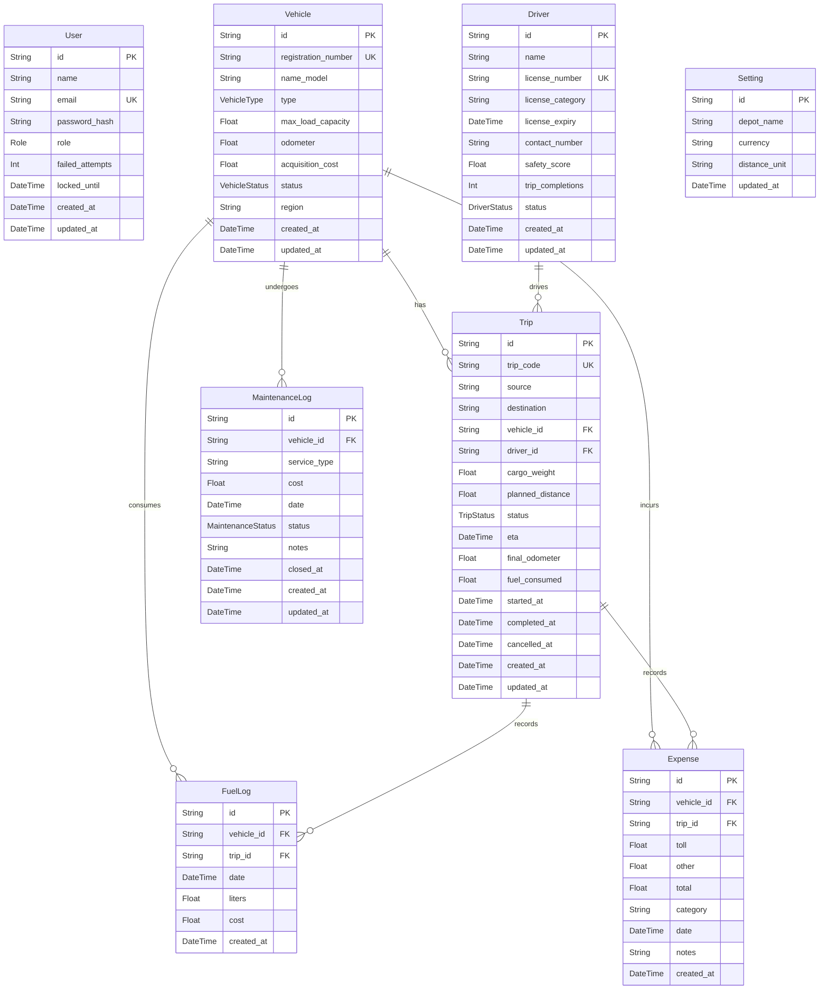

# TransitOps ER Diagram

This document contains the visual and textual representation of the TransitOps database schema.

```mermaid
erDiagram
    User {
        String id PK
        String name
        String email UK
        String password_hash
        Role role
        Int failed_attempts
        DateTime locked_until
        DateTime created_at
        DateTime updated_at
    }

    Vehicle {
        String id PK
        String registration_number UK
        String name_model
        VehicleType type
        Float max_load_capacity
        Float odometer
        Float acquisition_cost
        VehicleStatus status
        String region
        DateTime created_at
        DateTime updated_at
    }

    Driver {
        String id PK
        String name
        String license_number UK
        String license_category
        DateTime license_expiry
        String contact_number
        Float safety_score
        Int trip_completions
        DriverStatus status
        DateTime created_at
        DateTime updated_at
    }

    Trip {
        String id PK
        String trip_code UK
        String source
        String destination
        String vehicle_id FK
        String driver_id FK
        Float cargo_weight
        Float planned_distance
        TripStatus status
        DateTime eta
        Float final_odometer
        Float fuel_consumed
        DateTime started_at
        DateTime completed_at
        DateTime cancelled_at
        DateTime created_at
        DateTime updated_at
    }

    MaintenanceLog {
        String id PK
        String vehicle_id FK
        String service_type
        Float cost
        DateTime date
        MaintenanceStatus status
        String notes
        DateTime closed_at
        DateTime created_at
        DateTime updated_at
    }

    FuelLog {
        String id PK
        String vehicle_id FK
        String trip_id FK
        DateTime date
        Float liters
        Float cost
        DateTime created_at
    }

    Expense {
        String id PK
        String vehicle_id FK
        String trip_id FK
        Float toll
        Float other
        Float total
        String category
        DateTime date
        String notes
        DateTime created_at
    }

    Setting {
        String id PK
        String depot_name
        String currency
        String distance_unit
        DateTime updated_at
    }

    Vehicle ||--o{ Trip : "has"
    Driver ||--o{ Trip : "drives"
    Vehicle ||--o{ MaintenanceLog : "undergoes"
    Vehicle ||--o{ FuelLog : "consumes"
    Trip ||--o{ FuelLog : "records"
    Vehicle ||--o{ Expense : "incurs"
    Trip ||--o{ Expense : "records"
```

