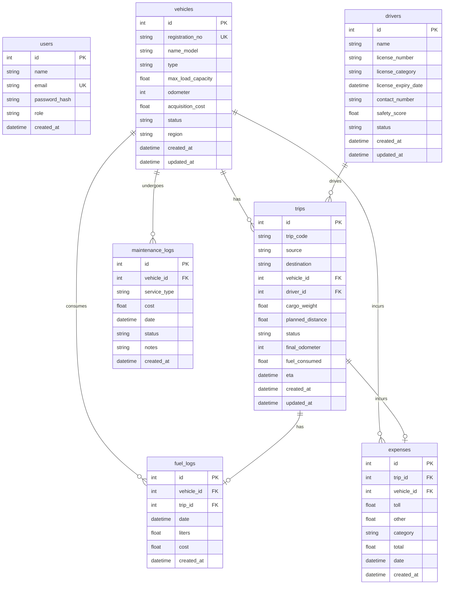

# TransitOps ER Diagram

*This document will contain the visual and textual representation of the TransitOps database schema.*

```mermaid
erDiagram
    users {
        int id PK
        string name
        string email UK
        string password_hash
        string role
        datetime created_at
    }

    vehicles {
        int id PK
        string registration_no UK
        string name_model
        string type
        float max_load_capacity
        int odometer
        float acquisition_cost
        string status
        string region
        datetime created_at
        datetime updated_at
    }

    drivers {
        int id PK
        string name
        string license_number
        string license_category
        datetime license_expiry_date
        string contact_number
        float safety_score
        string status
        datetime created_at
        datetime updated_at
    }

    trips {
        int id PK
        string trip_code
        string source
        string destination
        int vehicle_id FK
        int driver_id FK
        float cargo_weight
        float planned_distance
        string status
        int final_odometer
        float fuel_consumed
        datetime eta
        datetime created_at
        datetime updated_at
    }

    maintenance_logs {
        int id PK
        int vehicle_id FK
        string service_type
        float cost
        datetime date
        string status
        string notes
        datetime created_at
    }

    fuel_logs {
        int id PK
        int vehicle_id FK
        int trip_id FK
        datetime date
        float liters
        float cost
        datetime created_at
    }

    expenses {
        int id PK
        int trip_id FK
        int vehicle_id FK
        float toll
        float other
        string category
        float total
        datetime date
        datetime created_at
    }

    vehicles ||--o{ trips : "has"
    drivers ||--o{ trips : "drives"
    vehicles ||--o{ maintenance_logs : "undergoes"
    vehicles ||--o{ fuel_logs : "consumes"
    trips ||--o| fuel_logs : "has"
    vehicles ||--o{ expenses : "incurs"
    trips ||--o| expenses : "incurs"
```
